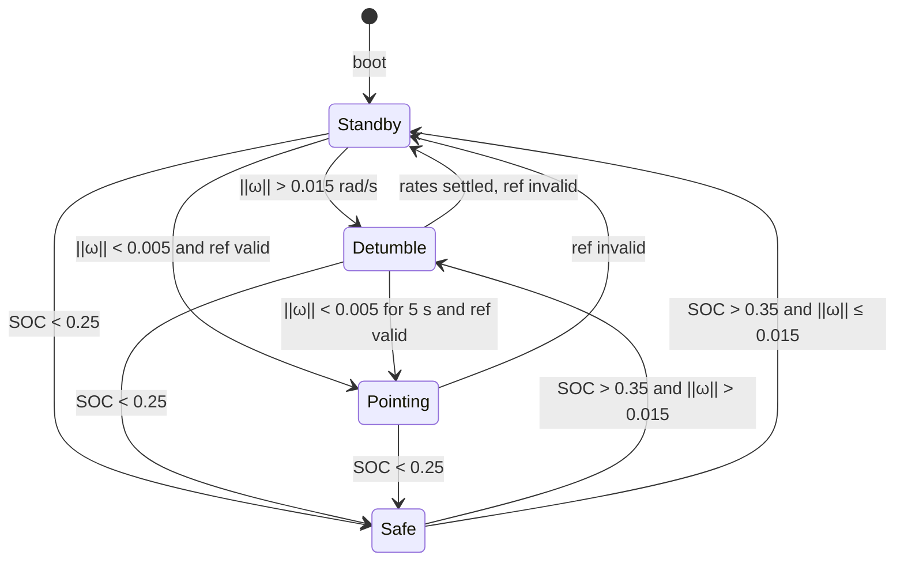

# Flight Software

This directory is the product: onboard ADCS, mode director, EPS energy policy, and FDIR (TMR on `ModeId` and flags, plus Health on sim `dt` and sensor ranges).

`SIL/cpp` calls `FlightSoftware::step` once per sensor packet. Basilisk is only the plant on the other side of that call.

## Cycle

```text
SIL applyTelecommand / FaultInjector  (before this call)
sensors → HealthMonitor::evaluateSensors
        → FDIR vote/repair ModeId (fail-safe Safe if no majority)
        → FDIR evaluate(HealthReport) → SensorGate + force_safe
        → StateEstimator (raw channels only if the gate allows)
        → HealthMonitor::noteAttitude
        → EPS (SOC deadband)
        → TMR on force_safe / allow_exit_safe / ref_ok
        → ModeDirector::selectNextMode
          (boot hold, then force_safe, then operator ForceMode, then table below)
        → enter/exit if mode changed
        → FDIR commit ModeId (write all 3 replicas)
        → active mode: error + PD + RW map
        → fillTm → AttitudeCommand (torques + ModeId / flags / Health / last-TC ACK / MRP)
```

Modes never pick the next mode. `AttitudeCommand.active_mode` is what flew this cycle. `FlightSoftware` wires EPS and FDIR into director flags; it does not contain the transition table. Operator TCs are decoded on `:5558` by SIL and passed as `(opcode, arg0, arg1)` into `applyTelecommand` **before** `step()`.

## Mode director

Implemented in `ModeDirector::selectNextMode` (`mode_director.cpp`). Rate thresholds live on the mode classes (`kEnterDetumbleRateRadps`, `kExitRateRadps`, `kExitHold_s`). SOC thresholds live on `EpsManager` (`kEnterSafeSoc` 0.25, `kExitSafeSoc` 0.35). Optional `bootStandbyDuration_s` (SIL `PACKET_BOOT_CONFIG`) holds Standby until that sim time — 60 s in the default demo, 0 in the FSW test scenarios.

The director does not read SOC or raw sensors. It sees `force_safe` (EPS low-SOC **or** FDIR: TMR fail-safe, `dt` going backwards, gyro out of range, or attitude stale for 50 cycles) and `allow_exit_safe` (EPS recovered **and** FDIR not forcing Safe). If `mode_forced` is set, that `ModeId` wins the table but **not** boot hold or `force_safe`. `current` is the voted `ModeId`, not the controller pointer.



While `t < bootStandbyDuration_s`, the director stays in Standby (no Detumble, Pointing, Safe, or operator ForceMode — boot hold preempts EPS, FDIR, and TCs). Pointing does **not** re-enter Detumble on body rate — the PD law can exceed the Standby tumble threshold during normal acquisition; only **Standby** (and **Safe** on exit) use `‖ω‖ > 0.015` to enter Detumble.

| Mode | Law | Notes |
|---|---|---|
| Standby | Command zeros (clears residual RW/MTB) | Dispatcher |
| Detumble | PD, `Kp = 0`, `Kd` on `−ω` | `ratesSettled()` is 5 s under 0.005 rad/s |
| Pointing | 2-axis PD on sun or nadir error | Default target: nadir (`−Z` to Earth) |
| Safe | Same sun error as Pointing-sun (`SunReference`) | Energy supervisor; +Z panels |

`ref_ok` is `nadir_valid` or `css_valid` according to the pointing target. In eclipse, nadir can stay valid (filter coasts); sun-pointing does not.

## EPS and FDIR

`EpsManager` owns the SOC deadband (enter Safe below 0.25, leave above 0.35). The battery itself is still integrated in Basilisk; onboard EPS is policy on the telemetered SOC, not a second energy model. `modeLoadW` matches the plant's mode loads and is not applied to torque yet.

FDIR stores `ModeId` and the director flags in `Tmr<T>` (three replicas, majority vote, repair the dissenter). If there is no majority or the voted `ModeId` is not 0–3, FDIR writes Safe to all replicas and sets `force_safe`. Mismatch counts are in `FdirReport` and on the SIL status packet (`tmr_mismatch_count`, flags bits 16/32). Operator ForceMode is bit **64** on the same `flags` byte. A console line `FDIR TMR ModeId mismatch(repaired)` or `… (fail-safe Safe)` prints when the vote disagrees.

`HealthMonitor` (not `flight_software.cpp`) flags sim-time and sensor faults. `FdirManager::evaluate` maps that report to a `SensorGate` (do not copy gyro/mag/CSS this cycle) and/or `force_safe`. There is no local/platform/survival hierarchy yet.

| Fault | Invalidates | `force_safe` | `health_flags` |
|---|---|---|---|
| `dt < 0` | gyro + mag + CSS | yes | `0x01` |
| `dt > 1 s` | gyro | no | `0x02` |
| `\|ω_i\| > 2 rad/s` | gyro | yes | `0x04` |
| `\|B\|` outside `[5e3, 1e5]` nT | mag | no | `0x08` |
| CSS outside `[0, 2.5]` | CSS | no | `0x10` |
| Opposite CSS faces both `> 0.2` | CSS | no | `0x20` |
| `attitude_valid` false 50 cycles | — | yes | `0x40` |

`dt` is `SensorPacket.timestamp_s`, not wall-clock of `step()`. The status packet also echoes the last operator TC (`last_tc_opcode`, `last_tc_arg0`) until the next one.

Fault injection is **not** onboard FDIR. The SIL `FaultInjector` runs before `step()` (env vars or `TC_INJECT_FAULT` on `:5558`) and can bit-flip replica 0 of `ModeId` or force `batteryLevel = 0.10` (see [SIL README](../SIL/README.md#fault-injection-sil-only)). No gyro-vs-TRIAD consistency check, wheel-saturation detector, or wall-clock watchdog.

Boot Standby still preempts `force_safe` in the director, so a TMR fail-safe during the 60 s launcher hold does not stay in Safe until boot ends.

## Operator telecommands

`applyTelecommand` is the onboard dispatcher. SIL owns CRC, `:5558`, and `TC_INJECT_FAULT`. Console: [`SIL/tc_terminal.py`](../SIL/tc_terminal.py). Each opcode that reaches this function is latched as last-TC ACK on the status packet (`last_tc_opcode` / `last_tc_arg0`) until the next TC.

| Opcode | Console | Effect |
|---|---|---|
| `TC_FORCE_MODE` | `force <0..3>` | Latch mode (ignored if `arg0` > 3). Yields to boot hold and Safe. |
| `TC_CLEAR_FORCE` | `unforce` | Drop the latch only (FDIR counts unchanged). |
| `TC_INJECT_FAULT` | `inject <1\|2>` | SIL only: replica flip or SOC 0.10. |
| `TC_CLEAR_FAULTS` | `clear` | `fdir_.reset` to the **current** mode and `health_.reset` (counters/replicas/Health, not Standby). |
| `TC_SET_POINTING_TARGET` | `target <0\|1>` | Sun or nadir. Other `arg0` ignored. |
| `TC_RESET_ESTIMATOR` | `reset-est` | `StateEstimator::reset`. |
| `TC_SET_GAINS` / `TC_SET_THRESHOLDS` | numeric 7 / 8 | No-op until a parameter table exists. |
| `TC_RESET_FSW` | `reset-fsw` | `reset()`; keeps `bootStandbyDuration_s`. |

## ADCS pipeline

`StateEstimator` turns raw gyro, mag, and 6 CSS into `SpacecraftState`. `SensorGate` from FDIR can zero a channel this cycle so a wild measurement is not integrated.

| Block | Output |
|---|---|
| `CssWls` | Unit sun in body, `css_valid` |
| `OrbitPropagator` | Kepler `r_BN_N` → `nadir_N` / `nadir_B` |
| `SunModel` | Unit `sun_N` |
| `DipoleMagModel` | Unit `B_N` (IGRF-2020 centered dipole) |
| `Triad` | `C_triad` when sun and mag are usable |
| `AttitudeFilter` | `C_BN`, `gyro_bias`; lock held through eclipse |
| then | `ω = gyro − b̂` for control and the director |

Pointing errors: sun aligns body +Z with `ŝ_B`; nadir aligns body `−Z` with nadir. Both leave the boresight rotation unconstrained (`Kp_z = 0`).

## Layout

```text
types.h                    ModeId, SpacecraftState, AttitudeCommand
flight_software.h/.cpp     step, reset, applyTelecommand; wires estimator, EPS, FDIR, Health, director
mode_director.h/.cpp       transition table (boot, force_safe, ForceMode, rates, ref)
eps/                       SOC Safe deadband
health/                    sim dt + sensor-range / CSS incoherence / attitude stale
fdir/                      TMR; ModeId vote/repair; HealthReport → gate + force_safe
tm/                        fillTm (validity flags, Health bits, last-TC ACK, MRP)
operation_mode.h           enter / update / exit
modes/                     Standby, Detumble, Pointing, Safe
estimation/                CSS, Kepler, sun/mag, TRIAD, filter
pointing/                  SunReference, NadirReference
control/                   PD
actuators/                 body torque → RW (reaction sign + saturate)
math/                      vec3, mat3, DCM / MRP
```

C++ tests live in [`tests/`](../tests/) (`ctest` target `fsw_tests` from the SIL CMake build).
