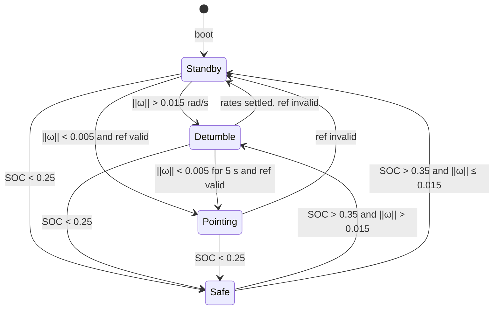

# Flight Software

This directory is the product: onboard ADCS and the mode director.

`SIL/cpp` calls `FlightSoftware::step` once per sensor packet. Basilisk is only the plant on the other side of that call.

## Cycle

```text
sensors → StateEstimator → SpacecraftState
        → selectNextMode  (boot hold, then Safe, then table below)
        → enter/exit if mode changed
        → active mode: error + PD + RW map
        → AttitudeCommand (torques + ModeId telemetry)
```

Modes never pick the next mode. `AttitudeCommand.active_mode` is what flew this cycle.

## Mode director

Implemented in `selectNextMode` (`flight_software.cpp`). Thresholds live on the mode classes (`kEnterDetumbleRateRadps`, `kExitRateRadps`, `kExitHold_s`, `kExitBatteryPercentage`). Optional `bootStandbyDuration_s` (SIL `PACKET_BOOT_CONFIG`) holds Standby until that sim time — 60 s in the default demo, 0 in the FSW test scenarios.



While `t < bootStandbyDuration_s`, the director stays in Standby (no Detumble, Pointing, or Safe). Pointing does **not** re-enter Detumble on body rate — the PD law can exceed the Standby tumble threshold during normal acquisition; only **Standby** (and **Safe** on exit) use `‖ω‖ > 0.015` to enter Detumble.

| Mode | Law | Notes |
|---|---|---|
| Standby | Command zeros (clears residual RW/MTB) | Dispatcher |
| Detumble | PD, `Kp = 0`, `Kd` on `−ω` | `ratesSettled()` is 5 s under 0.005 rad/s |
| Pointing | 2-axis PD on sun or nadir error | Default target: nadir (`−Z` to Earth) |
| Safe | Same sun error as Pointing-sun (`SunReference`) | Supervisor; +Z panels |

`ref_ok` is `nadir_valid` or `css_valid` according to the pointing target. In eclipse, nadir can stay valid (filter coasts); sun-pointing does not.

## ADCS pipeline

`StateEstimator` turns raw gyro, mag, and 6 CSS into `SpacecraftState`:

| Block | Output |
|---|---|
| `CssWls` | Unit sun in body, `css_valid` |
| `OrbitPropagator` | Kepler `r_BN_N` → `nadir_N` / `nadir_B` |
| `SunModel` | Unit `sun_N` |
| `DipoleMagModel` | Unit `B_N` (IGRF-2020 centered dipole) |
| `Triad` | `C_triad` when sun and mag are usable |
| `AttitudeFilter` | `C_BN`, `gyro_bias`; lock held through eclipse |
| then | `ω = gyro − b̂` for control and the director |

Pointing errors: sun aligns body +Z with `ŝ_B`; nadir aligns body `−Z` with nadir. Both leave the boresight rotation unconstrained (`Kp_z = 0`).

## Layout

```text
types.h                    ModeId, SpacecraftState, AttitudeCommand
flight_software.h/.cpp     step, reset, mode director
operation_mode.h           enter / update / exit
modes/                     Standby, Detumble, Pointing, Safe
estimation/                CSS, Kepler, sun/mag, TRIAD, filter
pointing/                  SunReference, NadirReference
control/                   PD
actuators/                 body torque → RW (reaction sign + saturate)
math/                      vec3, mat3, DCM / MRP
```
