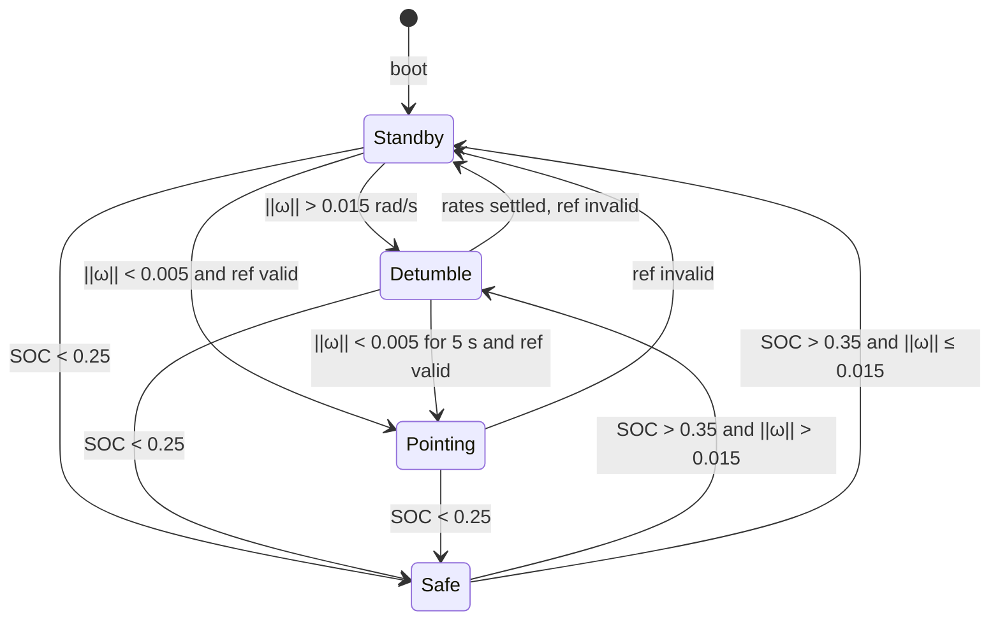
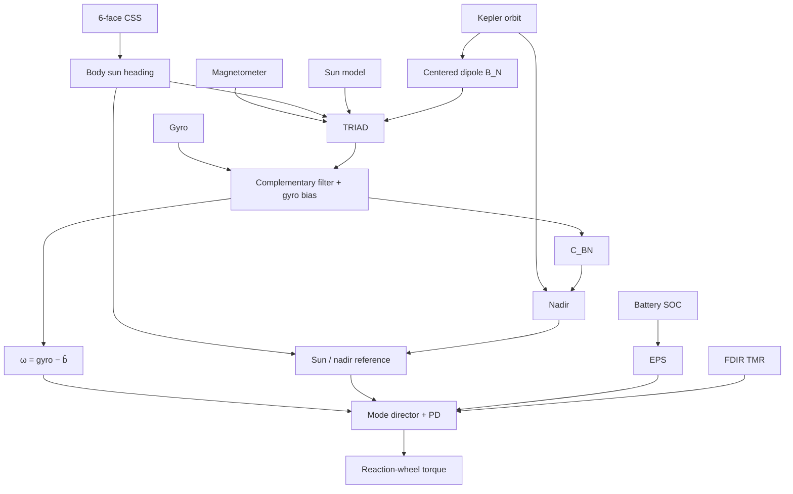
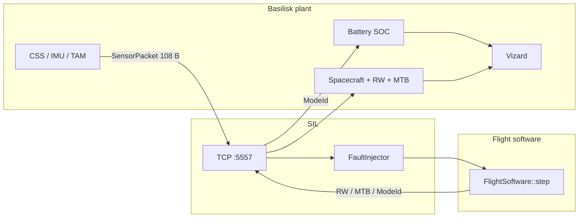

# Onboard ADCS Flight Software

C++17 flight software for a LEO spacecraft: **attitude determination**, **attitude control**, an autonomous **mode director**, onboard **EPS** energy policy, and **FDIR** (TMR on mode and critical flags).

[Basilisk](https://hanspeterschaub.info/basilisk/) is the dynamics environment used to exercise it. A thin software-in-the-loop (SIL) link carries sensors in and actuator commands out. The GNC logic lives in [`FlightSoftware/`](FlightSoftware/README.md) — it does **not** copy attitude from the simulator.


*Basilisk LEO plant → TCP SIL → `FlightSoftware::step` → RW torque back. Battery SOC and FSW mode come from the status packet, not from truth in the simulator.*

## Mode director

`ModeDirector::selectNextMode` is the only place that changes mode. Each mode only computes torque. `EpsManager` owns the SOC deadband and can request Safe; `FdirManager` votes a triplicated `ModeId` and can force Safe if the replicas disagree or the value is illegal. The default demo also holds **Standby for 60 s of sim time** (launcher separation) via `run(boot_standby_s=60)`; the FSW test scenarios leave this at 0.



| Mode | What it flies | Why it exists |
|---|---|---|
| **Standby** | Zero RW / MTB | Idle; dispatcher into Detumble or Pointing |
| **Detumble** | Rate damping (`Kp = 0`) | Kill tumble before pointing |
| **Pointing** | 2-axis PD, nadir (default) or sun | Mission attitude |
| **Safe** | Sun-point body +Z (`SunReference`) | Energy: panels toward the sun when SOC is low |

Battery uses a **level** deadband in `EpsManager` (enter &lt; 0.25, exit &gt; 0.35), not a time hold. Rate damping uses a 5 s dwell under 0.005 rad/s so Pointing does not start on a single quiet sample. The `‖ω‖ > 0.015` Detumble entry applies from **Standby** (and **Safe** on exit), not from Pointing — the pointing controller can legitimately exceed that rate during acquisition. Pointing/sun references must be valid (`nadir_valid` or `css_valid`) before leaving Detumble or Standby for Pointing; if the reference drops in Pointing, the director returns to Standby. While boot Standby is held, neither EPS nor FDIR TMR fail-safe can stay in Safe.

Each `step()`:

1. Estimate spacecraft state (onboard models + sensors).
2. FDIR majority-vote `ModeId` (repair 2-of-3; Safe if no majority or illegal id).
3. EPS on SOC; TMR on `force_safe` / `allow_exit_safe` / `ref_ok`.
4. Choose the next mode (optional boot Standby hold, then `force_safe`, then the table above).
5. `exit` / `enter` if the mode changed; FDIR commits the three `ModeId` replicas.
6. Run **that** mode’s controller. `active_mode` is telemetry of the mode that flew, not a request.

## Attitude determination and control



Onboard chain (truth vectors in the SIL packet are logs only):

- CSS → unit sun in body
- Kepler two-body `r_BN` from mission elements → nadir
- Analytic sun direction and IGRF-2020 centered dipole in ECI
- TRIAD (sun + mag) seeds / corrects a complementary `C_BN` filter; bias `b̂` is estimated in sunlight and frozen in eclipse
- PD on attitude error + bias-corrected rate; RW mapper saturates and applies the reaction-torque sign

## Verification (SIL vs Basilisk truth)

The sensor packet carries **verification fields** (`sigma_BN`, `r_BN`, `sun_N`, `B_N`, …) that the onboard estimator must **not** use. They exist only so `sensor_receiver.exe` can compare the FSW state to Basilisk truth every 5 s (`printEstCompare` in `flight_software.cpp`).

```text
Est t=... |dr|=... m  SunN=... MagN=...  SunB=... MagB=...
          TRIAD=... Att=... |b|=... deg/h  NadirN=... NadirB=...
```

| Metric | Meaning | Typical demo (`detumble_to_pointing`, sunlight) |
|---|---|---|
| **Att** | Geodesic angle between filtered `C_BN` and truth DCM | **&lt; 0.5°** after filter settle |
| **NadirB** | Nadir direction in body vs truth (Pointing nadir) | **&lt; 0.2°** when `Mode=Pointing` |
| **\|b\|** | Estimated gyro bias norm | Converges to **~36 deg/h** (planted IMU bias 0.01 °/s) |
| **SunB / MagB** | CSS / TAM body vectors vs truth | **&lt; 1°** in sun (MagB noisier from TAM) |
| **\|dr\|** | Kepler `r_BN` vs sim truth | **~1–2 m** (two-body demo orbit) |
| **‖ω‖** | Body rate from gyro − `b̂` | Detumble **&gt; 0.015 → &lt; 0.005 rad/s** before Pointing |

**Control:** after boot Standby (60 s in the default demo), expect **Standby → Detumble → Pointing** on the `Mode=` console line and Vizard FSW-mode bar. Pointing does not re-enter Detumble on rate alone — only **Standby** and **Safe** (on exit) use the 0.015 rad/s tumble threshold.

**Estimation:** in eclipse, `css_valid` drops but `nadir_valid` can remain (filter coasts on gyro); attitude error should not step-change solely because the sun sensors are dark (`eclipse_coast.py`).

Offline sensor plots (no Vizard): run with `log_sensors=True`, `show_plots=True`, `real_time=False` — see [BasiliskSim/README.md](BasiliskSim/README.md#offline-run-vizard-bin-no-sil).

## Exercising the FSW

Basilisk is the LEO SSO plant (sensors, wheels, eclipse, demo battery). SIL is only the link: 108-byte sensors in, 32-byte commands out (RW, optional MTB, and `ModeId` every cycle).



| Piece | Role |
|---|---|
| `FlightSoftware/` | ADCS, mode director, EPS, FDIR TMR (`step` once per packet) |
| `SIL/cpp/` | TCP server, packed protocol, CRC-32, optional fault injection |
| `BasiliskSim/` | Plant, SOC, Vizard, Python bridge |

Ports: **5556** Vizard DirectComm, **5557** SIL duplex.

```powershell
py -3.11 -m venv .venv
.\.venv\Scripts\python.exe -m pip install -r BasiliskSim\requirements.txt
cmake -S SIL/cpp -B SIL/cpp/build
cmake --build SIL/cpp/build --config Release
.\SIL\cpp\build\Release\sensor_receiver.exe
.\.venv\Scripts\python.exe .\BasiliskSim\scenarios\basic_orbit_vizard.py
```

Or `.\run_sil.ps1` from the repo root (`VIZARD_EXE` optional). Details: [FlightSoftware](FlightSoftware/README.md), [SIL](SIL/README.md), [BasiliskSim](BasiliskSim/README.md).

**Reproducible FSW scenarios** — thin scripts under `BasiliskSim/scenarios/` with fixed initial conditions (rates, SOC, orbit phase) and docstrings describing the expected mode chain (Detumble, Pointing, Safe, eclipse coast). Same SIL startup; pick a case instead of the default demo, e.g. `.\.venv\Scripts\python.exe .\BasiliskSim\scenarios\detumble_to_pointing.py`. Full table and thresholds: [BasiliskSim/README.md](BasiliskSim/README.md#reproducible-fsw-test-scenarios).

## Layout

```text
FlightSoftware/     ADCS + mode director + EPS + FDIR TMR  ← this is the product
SIL/cpp/            I/O adapter (TCP, CRC, packed structs, SIL-only fault injection)
BasiliskSim/        Dynamics environment (plant, SOC, Vizard)
```

## Limitations (demo)

- Demo battery in Basilisk (mode + `|τ|` load, small capacity so SOC moves in 1–2 orbits). Onboard EPS is SOC policy only. FDIR TMR protects `ModeId` and director flags. SIL can inject a one-shot `ModeId` replica bit-flip or SOC drop (`ADCS_INJECT_MODE_AT` / `ADCS_INJECT_SOC_AT`; see [SIL](SIL/README.md#fault-injection-sil-only)). No sensor-range detectors or mismatch telemetry on the SIL packet yet.
- Detumble on reaction wheels only; magnetorquers are in the plant but unused.
- Pointing is two-axis (no yaw / ground-track constraint).
- Orbit / sun / mag models match this scenario, not GPS/TLE or full-order IGRF.
- No automated CSV or unit tests; verification is console `Est` lines and optional offline plots (see [Verification](#verification-sil-vs-basilisk-truth)).

## License

MIT — see [LICENSE](LICENSE).
